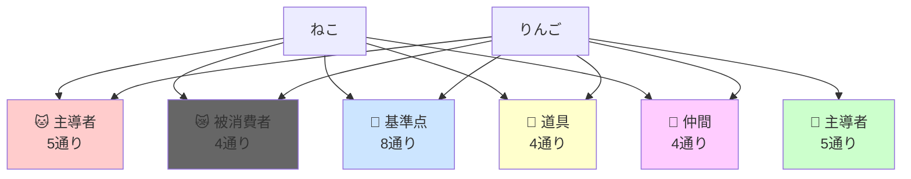

# 格助詞組み合わせ分析：「ねこ（）りんご（）たべた」
## 助詞が作り出す「ねじれた関係性」を視覚化する30の異なるシーン

---

## 全30通り - 視覚的シーン設定重視版

### 🐱 **カテゴリー1：猫が主導する世界**（5通り）
猫が行為の中心となり、りんごとの関係性を能動的に作り出す

#### 01. ねこ**が**りんご**を**たべた
- **視覚シーン**：リビングで猫が床に転がったりんごに噛みついている。りんごには歯型が残り、果汁が飛び散っている
- **関係性**：標準的な主語・目的語の関係（猫→りんご）
- **ねじれポイント**：最も自然で基準となるシーン

#### 02. ねこ**が**りんご**に**たべた  
- **視覚シーン**：猫がりんご畑の木に登り、木に実ったりんごに向かって魚の干物を食べている。りんごに「捧げる」ような構図
- **関係性**：りんごが「方向・対象」となる不思議な関係
- **ねじれポイント**：食べる行為の方向先がりんご

#### 03. ねこ**が**りんご**で**たべた
- **視覚シーン**：猫が巨大りんごの皮をナイフのように使って、魚を切り分けて食べている。りんごは道具として扱われている
- **関係性**：りんごが「手段・道具」に変化
- **ねじれポイント**：りんごが食材から道具へ

#### 04. ねこ**が**りんご**と**たべた
- **視覚シーン**：猫と擬人化されたりんご（顔と手足がある）が同じテーブルに向かい合って座り、一緒にケーキを食べている。友達のような雰囲気
- **関係性**：猫とりんごが「対等な仲間」
- **ねじれポイント**：りんごが食材から友人へ

#### 05. ねこ**が**りんご**へ**たべた
- **視覚シーン**：猫が矢印で示されたりんごの置かれた方向（遠く）を向いて、ドライフードを食べながら前進している。巡礼のような雰囲気
- **関係性**：りんごが「目的地・方角」
- **ねじれポイント**：食行為の方向性が強調される

---

### 🍎 **カテゴリー2：りんごが主体となる逆転世界**（5通り）
通常ありえない「りんごが主語」となる世界

#### 06. ねこ**を**りんご**が**たべた
- **視覚シーン**：巨大化したりんご（2メートル級）が大きな口を開け、小さな猫を丸呑みにしようとしている。ホラー的な構図
- **関係性**：主客逆転（りんご→猫）
- **ねじれポイント**：食物が捕食者に

#### 07. ねこ**に**りんご**が**たべた
- **視覚シーン**：猫の背中の上にりんごが乗っており、誰か見えない存在によってりんごがかじられている。猫は困惑した表情
- **関係性**：猫が「場所・基準点」、りんごが「被食者」
- **ねじれポイント**：猫の上でりんごが食べられる受動的状況

#### 08. ねこ**で**りんご**が**たべた
- **視覚シーン**：猫の鋭い爪をおろし金のように使って、りんごがすりおろされている。猫自身も驚いた顔
- **関係性**：猫が「道具」、りんごが「被加工物」
- **ねじれポイント**：猫が意思のない道具として機能

#### 09. ねこ**と**りんご**が**たべた
- **視覚シーン**：猫と擬人化りんごが二人で協力してピザを食べている。共同作業の雰囲気で、両者対等な立場
- **関係性**：猫とりんごが「共同主体」
- **ねじれポイント**：両者が等しく主語になる

#### 10. ねこ**へ**りんご**が**たべた
- **視覚シーン**：りんごが猫の方向に向かって転がりながら、道中の草や虫を「食べて」吸収している。猫は遠くで待っている
- **関係性**：猫が「終着点」、りんごが「移動する主体」
- **ねじれポイント**：りんごが猫に向かって行動する

---

### 😿 **カテゴリー3：猫が消費される暗黒シーン**（4通り）
猫が「食べられる対象」になる不穏な世界

#### 11. ねこ**を**りんご**に**たべた
- **視覚シーン**：巨大なりんごタルト（パイ）の中に猫が入れられ、オーブンで焼かれている。りんごが「容器・場所」として機能
- **関係性**：猫が「材料」、りんごが「レシピの一部（場所）」
- **ねじれポイント**：猫とりんごが共に料理素材に

#### 12. ねこ**を**りんご**で**たべた
- **視覚シーン**：シェフ（人の影）がりんごソースをかけた猫肉料理を作っている。りんごが「調味料・添え物」として使われている
- **関係性**：猫が「主材料」、りんごが「副材料・調理法」
- **ねじれポイント**：りんごが猫を美味しくする手段

#### 13. ねこ**を**りんご**と**たべた
- **視覚シーン**：大きな皿に猫とりんごが等しく盛り付けられ、フォークとナイフが添えられている。コース料理のような演出
- **関係性**：猫とりんごが「同列の食材」
- **ねじれポイント**：両者が等価値の食材として扱われる

#### 14. ねこ**を**りんご**へ**たべた
- **視覚シーン**：猫が巨大なりんごの彫刻（口が開いている）の方向に引きずられていく。りんごは神殿のような存在感
- **関係性**：猫が「供物」、りんごが「神・受け手」
- **ねじれポイント**：りんごが崇拝対象で猫が捧げられる

---

### 📍 **カテゴリー4：猫が受容者・基準点となる世界**（8通り）
猫が「場所」「方向」「受け手」として機能する複雑な関係

#### 15. ねこ**に**りんご**を**たべた
- **視覚シーン**：人間の手が猫にりんごのスライスを差し出している。猫は戸惑いながらも口を開けている
- **関係性**：猫が「受取人」、りんごが「贈与物」
- **ねじれポイント**：猫に食べさせる授与の関係

#### 16. ねこ**に**りんご**で**たべた
- **視覚シーン**：猫の目の前で、りんごを器のように使って（くり抜いて）その中にキャットフードを入れて与えている
- **関係性**：猫が「受益者」、りんごが「容器・手段」
- **ねじれポイント**：りんごが器として機能

#### 17. ねこ**に**りんご**と**たべた
- **視覚シーン**：猫の前に、りんごと魚の切り身が一緒のお皿に盛られている。「一緒に食べてね」という雰囲気
- **関係性**：猫が「受取人」、りんごと何かが「セット商品」
- **ねじれポイント**：組み合わせメニューの提供

#### 18. ねこ**に**りんご**へ**たべた
- **視覚シーン**：猫がりんごの木の下に座り、木から落ちてくるりんごを受け止めようとしている。空からりんごが降ってくる
- **関係性**：猫が「受け手」、りんごが「終着点への道」
- **ねじれポイント**：二重の方向性（猫に・りんごへ）

#### 19. ねこ**へ**りんご**を**たべた
- **視覚シーン**：人が猫の方を向いて、猫に見せつけるようにりんごを大げさに食べている。猫は羨ましそうに見ている
- **関係性**：猫が「観客・方向」、りんごが「舞台の食材」
- **ねじれポイント**：猫に向けたパフォーマンス

#### 20. ねこ**へ**りんご**に**たべた
- **視覚シーン**：猫の住む小屋に向かって、りんごの木の上で誰かが何かを食べている。遠距離の構図
- **関係性**：猫が「方向」、りんごが「場所」
- **ねじれポイント**：二重の位置関係

#### 21. ねこ**へ**りんご**で**たべた
- **視覚シーン**：猫に向かってりんごを投げながら、投げた人がサンドイッチを食べている。動的なシーン
- **関係性**：猫が「的・方向」、りんごが「投擲物・道具」
- **ねじれポイント**：りんごが飛び道具に

#### 22. ねこ**へ**りんご**と**たべた
- **視覚シーン**：猫の方向を向いて歩きながら、りんごとパンを同時に食べている人。猫は遠くで待っている
- **関係性**：猫が「目的地」、りんごが「道連れ」
- **ねじれポイント**：移動しながらの食事

---

### 🔧 **カテゴリー5：猫が物化する道具世界**（4通り）
猫が生き物ではなく「もの」として扱われる

#### 23. ねこ**で**りんご**を**たべた
- **視覚シーン**：猫の体を台にして、その上でりんごを切って食べている。猫はまな板のように使われている
- **関係性**：猫が「台・道具」、りんごが「食材」
- **ねじれポイント**：猫の物体化（まな板）

#### 24. ねこ**で**りんご**に**たべた
- **視覚シーン**：猫をハシゴのように使って、りんごの木に登り、木の上で何かを食べている
- **関係性**：猫が「梯子・足場」、りんごが「目標地点」
- **ねじれポイント**：猫が昇降具に

#### 25. ねこ**で**りんご**と**たべた
- **視覚シーン**：猫の背中を皿にして、その上にりんごと他の料理が乗せられている。猫は運搬係
- **関係性**：猫が「皿・運搬具」、りんごが「食材の一つ」
- **ねじれポイント**：猫が食器に

#### 26. ねこ**で**りんご**へ**たべた
- **視覚シーン**：猫をカタパルトのように使って、りんごの方向に食べ物を飛ばしている。猫は発射台
- **関係性**：猫が「発射装置」、りんごが「着地点」
- **ねじれポイント**：猫が投石器に

---

### 🤝 **カテゴリー6：猫が仲間となる共存世界**（4通り）
猫が「パートナー」「同伴者」として扱われる温かい関係

#### 27. ねこ**と**りんご**を**たべた
- **視覚シーン**：人と猫が同じテーブルで向かい合い、一つのりんごを分け合って食べている。対等な食事仲間
- **関係性**：猫が「共食者」、りんごが「共有物」
- **ねじれポイント**：猫が人間と同格

#### 28. ねこ**と**りんご**に**たべた
- **視覚シーン**：猫と人が巨大りんご（家サイズ）の上でピクニックをしている。りんごが「場所」として機能
- **関係性**：猫が「仲間」、りんごが「舞台」
- **ねじれポイント**：りんごが建造物規模

#### 29. ねこ**と**りんご**で**たべた
- **視覚シーン**：猫と人がりんごをくり抜いた器を作り、その中で一緒にスープを飲んでいる。共同作業の温かさ
- **関係性**：猫が「協力者」、りんごが「自作食器」
- **ねじれポイント**：りんごのDIY的活用

#### 30. ねこ**と**りんご**へ**たべた
- **視覚シーン**：猫と人がりんご農園に向かって歩きながら、おにぎりを食べている。二人旅の雰囲気
- **関係性**：猫が「旅仲間」、りんごが「目的地」
- **ねじれポイント**：りんごが場所（農園）の象徴

---

## 6つのカテゴリーによる関係性マップ

## カテゴリー別特徴まとめ

| カテゴリー | 猫の役割 | りんごの役割 | 視覚的トーン | 組み合わせ数 |
|---------|---------|------------|------------|------------|
| **🐱 猫が主導** | 主体・行為者 | 目的語/道具/仲間/方向 | 日常的〜ファンタジー | 5通り |
| **🍎 りんごが主導** | 目的語/場所/道具/仲間/方向 | 主体・行為者 | ファンタジー〜ホラー | 5通り |
| **😿 猫が消費** | 被食材 | 場所/手段/共材/終点 | ダーク・グロテスク | 4通り |
| **📍 猫が基準点** | 受取人/観客/目的地 | 贈与物/道具/展示物 | 関係性重視 | 8通り |
| **🔧 猫が道具** | 物体・装置 | 食材/目標/素材 | シュール・無機質 | 4通り |
| **🤝 猫が仲間** | パートナー・同伴者 | 共有物/場所/道具 | 温かい・協力的 | 4通り |

---

## 視覚化のポイント

### 全30シーンを明確に区別するための要素

1. **構図の変化**：俯瞰/正面/横/斜め/クローズアップ
2. **サイズ比の変化**：巨大りんご/通常/小さな猫
3. **場所の変化**：室内/屋外/木の上/皿の上/空中
4. **登場キャラ**：猫のみ/りんごのみ/両方/第三者の手や影
5. **擬人化の有無**：りんごに顔や手足をつけるか
6. **動き**：静止/移動/回転/落下/投げる
7. **感情表現**：猫の表情（驚き/困惑/喜び/恐怖）
8. **時間帯・照明**：昼/夜/スポットライト

これにより、30通り全てが視覚的に一目で区別できる独立したシーンが完成します。
